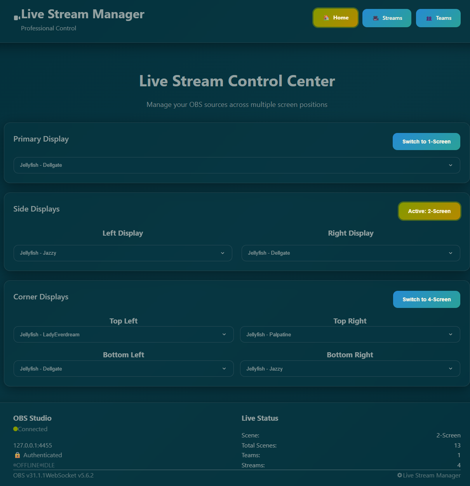

# CueSheet

CueSheet is a professional [Next.js](https://nextjs.org) web application for managing live streams and controlling multiple OBS [Source Switchers](https://github.com/exeldro/obs-source-switcher) with real-time WebSocket integration and modern glass morphism UI.




## Features

- **Studio Mode Support**: Full preview/program scene management with transition controls for professional broadcasting
- **OBS Scene Control**: Switch between OBS layouts (1-Screen, 2-Screen, 4-Screen) with dynamic button states
- **Multi-Screen Source Control**: Manage 7 different screen positions (large, left, right, and 4 corners)
- **Real-time OBS Integration**: WebSocket connection with live status monitoring
- **Enhanced Stream Management**: Create, edit, and delete streams with comprehensive OBS cleanup
- **Team Organization**: Organize streams by teams with full CRUD operations and scene synchronization
- **Collapsible Stream Groups**: Organized stream display with expandable team groups for better UI management
- **Comprehensive Deletion**: Remove streams/teams with complete OBS component cleanup (scenes, sources, text files)
- **Streamlink Media Sources**: Streams are added as OBS Media Sources (`ffmpeg_source`) fed by an external Streamlink + ffmpeg pipeline by default, with a browser-source fallback
- **Low-Memory Pipeline**: External Streamlink decode (~44 MB/stream) avoids spawning a full CEF/Chromium instance per browser source, so OBS scales to dozens of simultaneous streams without running out of memory
- **Live-Reload Supervisor**: A standalone Streamlink supervisor reads the stream list from the DB, runs one streamlink→ffmpeg→UDP pipeline per stream, auto-respawns failed pipelines, and reloads on demand when streams are added/removed (no restart required)
- **Modern UI**: Glass morphism design with responsive layout and accessibility features
- **Professional Broadcasting**: Audio routing, scene management, and live status indicators
- **Dual Integration**: WebSocket API + text file monitoring for maximum compatibility
- **UUID-based Tracking**: Robust OBS group synchronization with rename-safe tracking
- **Enhanced Footer**: Real-time team/stream counts, OBS connection status, and studio mode indicators
- **API Security**: Optional API key authentication for production deployments
- **Optimized Performance**: Consolidated CSS architecture and standardized API responses

## Quick Start

```bash
npm install
npm run dev
```

Open [http://localhost:3000](http://localhost:3000) to access the control interface.

### Production build

`next.config.ts` sets `output: "standalone"`, so `npm run build` emits a
self-contained bundle at `.next/standalone` (a `server.js` plus a minimal
`node_modules` that includes the `sqlite3` native module). Deploy by copying
that folder alongside `.next/static` and `public`, then:

```bash
node .next/standalone/server.js
```

No `next start` and no full `npm install` on the host. The bundle includes the
**host platform's** prebuilt native modules, so build on the target OS — for the
Windows OBS host, run `npm run build` on Windows.

The Streamlink supervisor can likewise be shipped as a single `.exe` — see
[`scripts/streamlink-supervisor/README.md`](scripts/streamlink-supervisor/README.md#single-executable-build-bun).

## Unified `cuesheet` binary

The old per-task launch scripts (`run-dev.cmd`, `run-sup.cmd`, `watch.ps1`,
`gui.ps1`, `mon-start.ps1`, …) have been replaced by a **single cross-platform
binary**, `cuesheet`, built with `bun build --compile`. One executable runs the
web UI, the Streamlink supervisor (compiled in — no `tsx`), the monitors, and the
ops/test tools on Windows, macOS, and Linux.

### Download (GitHub releases)

Each tagged release attaches a prebuilt binary per platform (verify against
`SHA256SUMS.txt`):

| File | Platform |
| --- | --- |
| `cuesheet-windows-x64.exe` | Windows x64 |
| `cuesheet-macos-arm64` | macOS (Apple Silicon) |
| `cuesheet-macos-x64` | macOS (Intel) |
| `cuesheet-linux-x64` | Linux x64 |

The binary is self-contained — no Node/Bun/`node_modules` needed. The only runtime
dependencies are `streamlink` and `ffmpeg` on PATH (run `cuesheet doctor` to check).
On macOS/Linux, `chmod +x` the download first.

> **Standalone vs. repo-only.** The released binary runs the supervisor and all
> monitoring/ops commands anywhere: `sup`, `status`, `watch`, `gui`, `start`/`stop`,
> `doctor`, `loadtest`, `soak`, `clean-obs`, `measure-latency`. The one exception is
> **`cuesheet dev`** — it runs the Next.js dev server, so it needs the project source
> + `node_modules` and only works from a repo checkout, not a standalone download.
> For a production webui, deploy the `next build` standalone bundle (see "Production
> build" above).

Cut a release by pushing a tag — `git tag v0.1.0 && git push origin v0.1.0` — and the
[`release` workflow](.github/workflows/release.yml) cross-compiles every target and
publishes them with checksums.

### Build (from source)

```bash
npm run binary:build:win     # -> dist/cuesheet.exe   (Windows x64)
npm run binary:build:mac     # -> dist/cuesheet-macos (macOS arm64)
npm run binary:build:linux   # -> dist/cuesheet-linux (Linux x64)
npm run binary:build         # -> dist/cuesheet       (host-native)
npm run binary:smoke         # smoke-test a built binary (--help / status / doctor)
```

During development you can run the same CLI without compiling:

```bash
npm run cli:dev -- <command>        # e.g. npm run cli:dev -- status
# or directly: bun run src/cli/main.ts <command>
```

### Commands

```
cuesheet dev                              # Next.js web UI (:3000) — spawns `next dev`
cuesheet sup                              # Streamlink supervisor (:8080) — runs in-process
cuesheet start [--which both|sup|web]     # launch dev/supervisor detached (tracked)
cuesheet stop  [--which both|sup|web]     # stop exactly what `start` launched
cuesheet status [--json|--logs|--diagnose]  # one-shot status (exit 0 = all up)
cuesheet watch                            # live status, refreshes every 2s
cuesheet gui                              # full-screen TUI control center (start/stop/restart)
cuesheet doctor                           # diagnose deps, ports, paths, resolved config
cuesheet loadtest | loaddriver | soak | clean-obs | measure-latency | verify-switcher-coverage
```

`cuesheet stop` tracks the PIDs it launched (in a managed run-state file) and
terminates only those process groups — unlike the old `mon-stop.ps1`, it never
blanket-kills unrelated `node` / `ffmpeg` / `streamlink` processes (e.g. a
running load test). Config resolution follows precedence **flag -> env ->
`.env.local` -> built-in default**; run `cuesheet doctor` to see every resolved
value and where it came from.

### Migration from the old scripts

| Old (Windows-only)            | New (all platforms)                       |
| ----------------------------- | ----------------------------------------- |
| `run-dev.cmd`                 | `cuesheet dev`                            |
| `run-sup.cmd`                 | `cuesheet sup`                            |
| `watch.cmd` / `watch.ps1`     | `cuesheet watch`                          |
| `status.cmd` / `status.ps1`   | `cuesheet status`                         |
| `mon-start.ps1`               | `cuesheet start --which both\|sup\|web`   |
| `mon-stop.ps1`                | `cuesheet stop`                           |
| `gui.cmd` / `gui.ps1`         | `cuesheet gui`                            |
| `monitor.cmd` (.NET WPF)      | `cuesheet gui` (cross-platform TUI)       |

> The .NET WPF monitor (`monitor/CueSheetMonitor.*`) is **deprecated** in favor
> of the cross-platform `cuesheet gui` TUI and will be removed in a follow-up.

## Configuration

### Environment Variables

Create `.env.local` in the project root:

```env
# File storage directory (optional, defaults to ./files)
FILE_DIRECTORY=C:\\OBS\\source-switching

# Event key — selects the per-event tables: streams_<EVENT_KEY> / teams_<EVENT_KEY>
# (optional, defaults to 2026_summer_sat). Lowercase letters, digits, underscores.
# Set the SAME value for the webui and the streamlink supervisor so they agree.
EVENT_KEY=2026_summer_sat

# OBS WebSocket settings (optional, these are defaults)
OBS_WEBSOCKET_HOST=127.0.0.1
OBS_WEBSOCKET_PORT=4455
OBS_WEBSOCKET_PASSWORD=your_password_here

# Security (IMPORTANT: Set in production)
API_KEY=your_secure_api_key_here

# --- Streamlink Media-Source pipeline (webui side) ---
# Set to "false" to roll back to legacy browser sources pointed at the Twitch URL
STREAM_USE_FFMPEG=true
# Where the webui pings POST /reload after add/remove (default below)
SUPERVISOR_URL=http://127.0.0.1:8080
# Deterministic relay-port mapping (MUST match the supervisor's values)
RELAY_HOST=127.0.0.1
RELAY_BASE_PORT=9000
RELAY_PORT_RANGE=2000
```

**`EVENT_KEY`** is the single knob that makes CueSheet generic across events.
Each event's data lives in its own pair of tables, `streams_<EVENT_KEY>` and
`teams_<EVENT_KEY>`. Point the app at a new event by setting `EVENT_KEY` in the
environment — no source edit, no rebuild. The webui (which writes those tables)
and the Streamlink supervisor (which reads them) must use the **same**
`EVENT_KEY`. An invalid value fails fast at startup rather than silently using
the wrong table.

#### Streamlink supervisor (runs on the OBS host)

The supervisor reads the same `.env`/environment as the webui (so the `RELAY_*`
and `EVENT_KEY` values match) plus its own settings:

```env
# Absolute paths to the binaries on the OBS host (recommended on Windows)
STREAMLINK_PATH=C:\\path\\to\\streamlink.exe
FFMPEG_PATH=C:\\path\\to\\ffmpeg.exe

# HTTP control/health server (dashboard at /, JSON at /health, POST /reload)
SUPERVISOR_HEALTH_HOST=127.0.0.1
SUPERVISOR_HEALTH_PORT=8080

# Per-stream log files (rotated)
SUPERVISOR_LOG_DIR=./logs/streamlink-supervisor
SUPERVISOR_LOG_MAX_BYTES=10485760
SUPERVISOR_LOG_RETAIN=5

# Optional: override the streams table the supervisor reads (defaults to the
# EVENT_KEY table, streams_<EVENT_KEY>); fallback port allocator for streams
# without a deterministic relay port (used mainly in tests)
STREAMS_TABLE=
SUPERVISOR_BASE_PORT=9001
SUPERVISOR_MAX_PORTS=8
```

> The webui (ffmpeg_source `input`) and the supervisor (UDP relay target)
> independently compute the **same** `udp://RELAY_HOST:(RELAY_BASE_PORT + id % RELAY_PORT_RANGE)`
> from the stream's database `id` — so `RELAY_HOST`, `RELAY_BASE_PORT`, and
> `RELAY_PORT_RANGE` must be identical on both. See `lib/relayPort.ts`.

### Security Setup

**⚠️ IMPORTANT**: Set `API_KEY` in production to protect your OBS setup from unauthorized access.

Generate a secure API key:
```bash
# Generate a random 32-character key
openssl rand -hex 32
```

Without an API key, anyone on your network can control your OBS streams.

### OBS Source Switcher Setup

1. In OBS, configure Source Switcher properties
2. Enable "Current Source File" at the bottom
3. Point to one of the generated text files (e.g., `large.txt`, `left.txt`)
4. Set read interval to 1000ms
5. Sources will switch automatically when files change

### Streamlink Media-Source pipeline

By default (`STREAM_USE_FFMPEG` unset or `true`), adding a stream creates an OBS
**Media Source** (`ffmpeg_source`) whose `input` is a **local UDP relay**
(`udp://127.0.0.1:<port>`), not the Twitch URL. This avoids spawning a full
CEF/Chromium instance per browser source (which exhausts OBS memory around ~40
streams); OBS only has to decode the incoming MPEG-TS.

A standalone **Streamlink supervisor** feeds those relays. Per stream it runs
roughly:

```bash
streamlink --stdout --hls-live-restart <twitchUrl> best \
  | ffmpeg -re -i pipe:0 -c copy -f mpegts "udp://127.0.0.1:<port>?pkt_size=1316"
```

Run it on the OBS host (alongside the webui and OBS):

```bash
npm run supervisor
```

- **Deterministic port**: both the webui (`ffmpeg_source` input) and the
  supervisor (relay target) compute the same port from the stream's database
  `id` via `lib/relayPort.ts` — no coordination or shared registry.
- **Control server**: the supervisor serves a status dashboard at `/`, JSON at
  `GET /health`, and accepts `POST /reload` (default `http://127.0.0.1:8080`,
  via `SUPERVISOR_HEALTH_PORT`).
- **Live reload**: after `addStream` and after team/stream deletion the webui
  pings `POST /reload` (`lib/supervisorClient.ts`, `SUPERVISOR_URL`), so the
  supervisor starts pipelines for newly-added streams and stops removed ones
  **without a restart**. This is best-effort — the add/remove still succeeds if
  the supervisor is down.
- **Auto-respawn**: pipelines are restarted on exit, escalating after 3
  restarts within 30s.
- **Rollback**: set `STREAM_USE_FFMPEG=false` to make `addStream` create a
  muted `browser_source` pointed at the Twitch URL instead (legacy behavior).

`streamlink` and `ffmpeg` must be installed on the OBS host; point the
supervisor at them with `STREAMLINK_PATH` / `FFMPEG_PATH`. The Source Switcher
`.txt`-file mechanism is unchanged — `setActive` still writes the stream-group
name and the OBS plugin polls each `${screen}.txt` every 1000ms.

### Database Setup

The project includes an empty template database for easy setup:

```bash
# Option 1: Use template database directly (development)
# Database will be created in ./files/sources.db
npm run create-sat-summer-2025-tables

# Option 2: Set up custom database location (recommended)
# 1. Copy the template database
cp files/sources.template.db /path/to/your/database/sources.db

# 2. Set environment variable in .env.local
echo "FILE_DIRECTORY=/path/to/your/database" >> .env.local

# 3. Create tables in your custom database
npm run create-sat-summer-2025-tables
```

**Template Database**: The repository includes `files/sources.template.db` with the proper schema but no data. Your local development database (`sources.db`) is automatically ignored by git to prevent committing personal data.

## Development Commands

```bash
npm run dev          # Start development server
npm run build        # Build for production
npm run start        # Start production server
npm run lint         # Run ESLint
npm run type-check   # TypeScript validation
npm test             # Run Jest test suite
npm run supervisor   # Run the Streamlink supervisor (streamlink+ffmpeg per stream)
```

### Operational / migration scripts

```bash
npm run convert:browser-to-media     # Convert existing browser sources to ffmpeg_source Media Sources
npm run verify:switcher-coverage     # Verify every webui-written name is covered by the OBS source switchers
npm run clean:obs-collection         # Clean up an OBS scene collection (season transitions)
npm run measure:switcher-latency     # Measure source-switch latency
npm run remap:mac-obs-switcher-paths # Remap switcher .txt paths for a macOS OBS install
npm run audit:sqlite-opens           # Audit SQLite open/close handling
npm run load:setactive               # Load-test the setActive endpoint
```

## Architecture

- **Frontend**: Next.js 15 with React 19 and TypeScript
- **Backend**: Next.js API routes with SQLite database
- **OBS Integration**: WebSocket connection + Source Switcher text-file monitoring
- **Media pipeline**: Streamlink supervisor → per-stream ffmpeg → local UDP relay → OBS `ffmpeg_source` Media Source (deterministic port via `lib/relayPort.ts`; live reload via `lib/supervisorClient.ts`)
- **Styling**: Custom CSS with glass morphism and Tailwind utilities
- **CI/CD**: GitHub Actions (`.github/workflows/`)

## API Documentation

The application provides a comprehensive REST API for managing streams, teams, and OBS integration. 

**📚 [Complete API Documentation](docs/API.md)**

Key endpoints include:
- Stream management (CRUD operations)
- Source control for 7 screen positions  
- Team and OBS group management
- Scene switching and studio mode controls
- Real-time status monitoring

All endpoints support API key authentication for production deployments.

See [`CLAUDE.md`](CLAUDE.md) for detailed architecture documentation and [`docs/API.md`](docs/API.md) for complete endpoint specifications.

## Known Issues

### Text Centering
- **Issue**: Team name text overlays position left edge at center instead of centering the text itself
- **Workaround**: Manually change "Positional Alignment" to "Center" in OBS UI
- **Status**: Under investigation - requires further research into OBS API behavior

### System Scene Exclusion
Infrastructure scenes containing source switchers are excluded from orphaned group detection:
- 1-Screen, 2-Screen, 4-Screen, Starting, Ending, Audio, Movies, Resources, Donor, BRB
- Additional scenes can be added to the `SYSTEM_SCENES` array in `/app/api/verifyGroups/route.ts`


